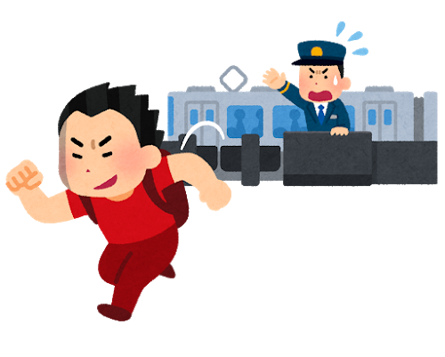

#  自宅のあるJR我孫子駅では、保線区から線路をまたいでちょいちょいとホームに上がれば６分は早い電車に乗れる
-  自動改札機の導入にJR東日本は積極的である
-  改札口を通るためだけに、毎日非常な遠回りをしている

#  しかし、しゃべらないことには何にも生まれない
-  沈黙は禁なり
-  相手に面と向って自分の意見を述べ、相手の意見を聞いて議論しよう

#  人生は一度しかないけれども大したことができる訳でもない
-  就職もしかり、最適化できるはずないじゃないか
-  たまたま縁のあった所に行こう、何とでもなるさ

#  いま、あなたの夢を語れと言われて、一つも言えない人は研究者には向かない
-  忙しいときは楽なんだよ
#  何もしないで指をくわえて見ているだけだったら、単なる無いものねだりだ
-  恋愛だって命がけだ

